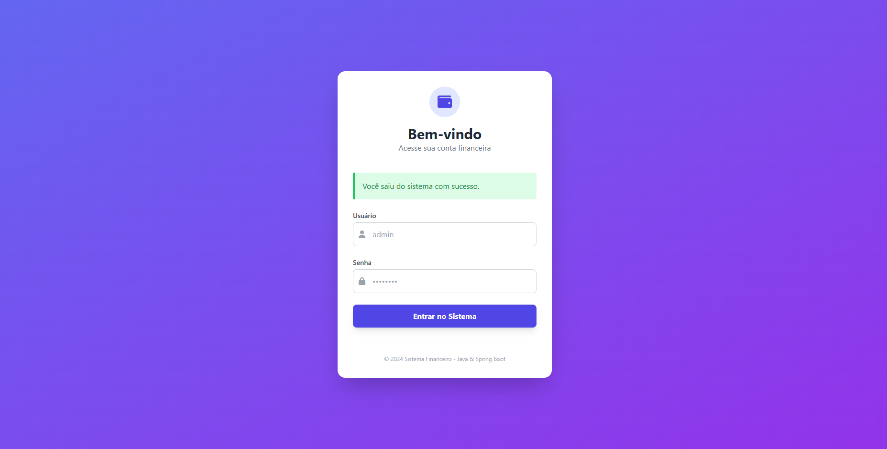
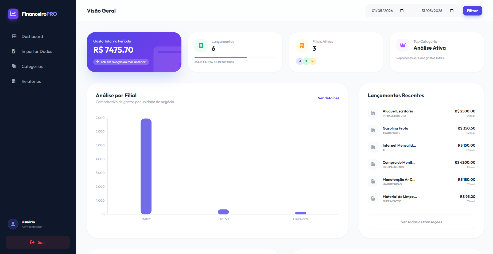
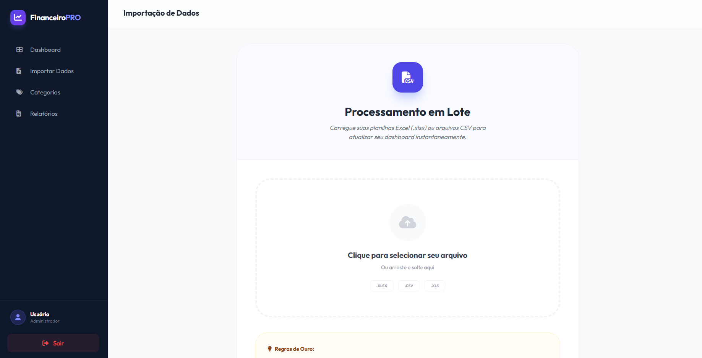
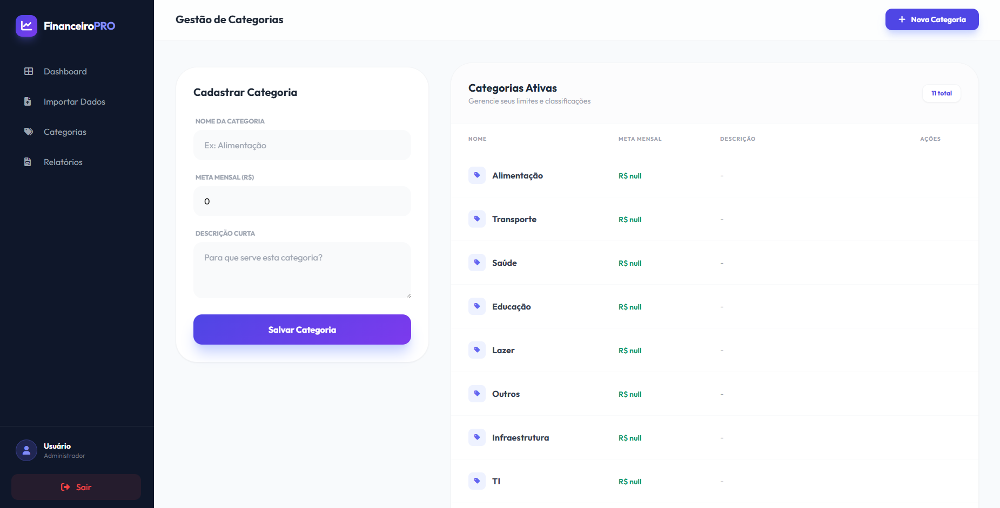
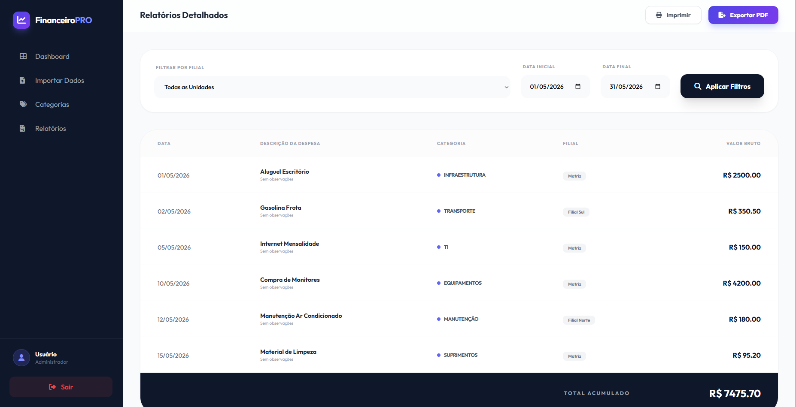

# Financeiro PRO - Gestão Inteligente de Despesas 

[](https://spring.io/projects/spring-boot)
[](https://www.oracle.com/java/)
[](https://www.mysql.com/)
[](https://tailwindcss.com/)

O **Financeiro PRO** é uma aplicação completa de gestão financeira desenvolvida para empresas que buscam controle total sobre seus gastos por filiais e categorias. Este projeto faz parte do meu portfólio de desenvolvedor e demonstra o uso de tecnologias modernas no ecossistema Java.

##  Funcionalidades

- **Dashboard Inteligente:** Visão geral de gastos com gráficos interativos (Chart.js), comparativos por filial e categorias.
- **Importação de Dados:** Processamento em lote de planilhas Excel (.xlsx) e arquivos CSV.
- **Gestão de Categorias:** Controle de orçamentos mensais (metas) por categoria.
- **Relatórios Avançados:** Filtros dinâmicos por período e filial com visual pronto para impressão.
- **Segurança:** Autenticação completa via Spring Security.
- **Design Premium:** Interface responsiva, moderna e intuitiva construída com Tailwind CSS.

##  Tecnologias Utilizadas

- **Backend:** Java 17, Spring Boot 3, Spring Data JPA, Spring Security.
- **Frontend:** Thymeleaf, Tailwind CSS, FontAwesome, Chart.js.
- **Banco de Dados:** MySQL.
- **Ferramentas:** Maven, Apache POI (Excel).

##  Como Executar o Projeto

### Pré-requisitos
- JDK 17 ou superior.
- MySQL 8.0+.
- IDE de sua preferência (VS Code, IntelliJ, Eclipse).

### Passos
1. Clone este repositório:
   ```bash
   git clone https://github.com/igoorpireess/projeto-financeiro.git
   ```
2. Crie o banco de dados no MySQL:
   ```sql
   CREATE DATABASE financeiro_db;
   ```
3. Configure suas credenciais do banco em `src/main/resources/application.properties`.
4. Execute o projeto via IDE ou comando:
   ```bash
   mvn spring-boot:run
   ```
5. Acesse `http://localhost:8080` (admin/admin123).

## Screenshots

### Login
<p align="center">
  
</p>

---

### Dashboard
<p align="center">
  
</p>

---

### Importação de Dados
<p align="center">
  
</p>

---

### Categorias
<p align="center">
  
</p>

---

### Relatórios
<p align="center">
  
</p>
---
Desenvolvido por Igor Pires(https://github.com/igoorpireess)
